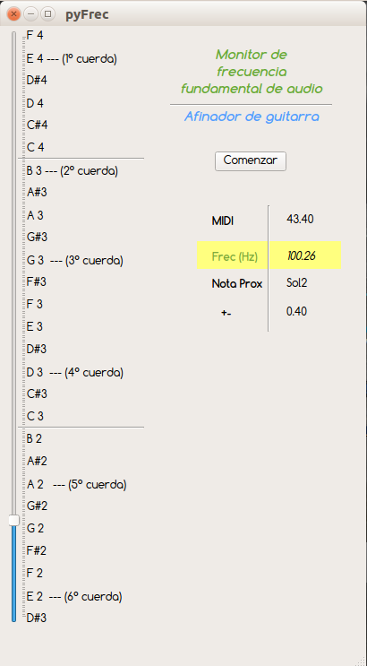

# Frecuencímetro-Afinador de guitarra con Python/PyQt5

 
(Monitor de frecuencia fundamental)

Aplicaciones: 
- En musica: como detector de tono (pitch) y reconocedor de rango vocal y afinador de instrumentos (por ejemplo: guitarra)
- En salud (herramienta de logopedas o terapistas del lenguaje)

Descargar programa para Windows en el siguiente link:
https://1drv.ms/u/s!Am8g-DQOgrqerl17CGBEn5oba_Xg?e=jIzzlI
http://www.educarte.pro/aplicaciones/pyfrec/pyfrec.exe

Encuentra el proyecto completo en: https://github.com/luisfico/tutorial_pyfrecuencimetro

(Basado en: https://github.com/michniewicz/python-tuner)

Video-tutorial de como hacer este programa en: 
https://youtu.be/U9E1Ps2EKig
https://www.youtube.com/watch?v=U9E1Ps2EKig&feature=youtu.be

 

Requerimientos para Linux (ejemplo en Ubuntu 20.04):
	
	sudo apt install python3-pyaudio

